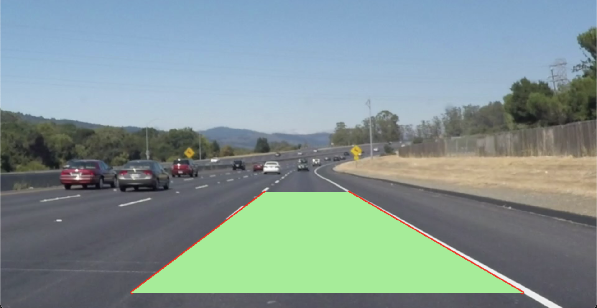
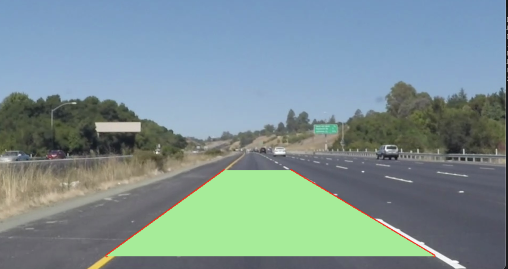
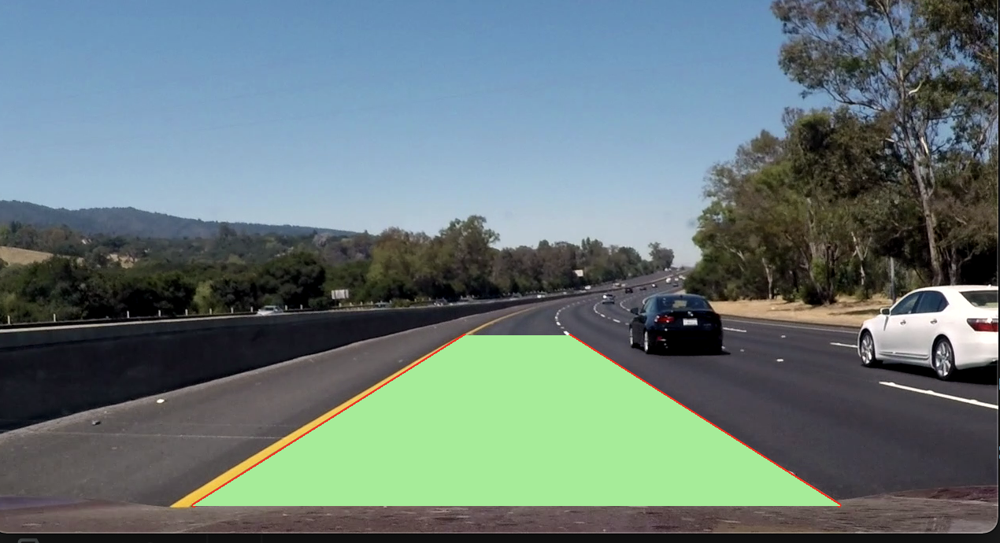

# Lane Detection 

A simple lane detection program made using Python's OpenCV Library, initially completed as a selection task for SWARM Robotics, IIT Kharagpur in 2022.

## Instructions 

- Usage: `python3 main.py <path-to-video> (optional)`
- If path is not provided as an argument, the program asks the level of the video as a prompt (1,2 or 3), and accordingly chooses from the 3 pre-existing videos
- All the functions used for this program are in the `functions.py` file

--- 

## Process and Methods Used
- Opening the video frame-by-frame using OpenCV library 
- Processing the video to isolate the lane lines: 
  - **Note:** I Isolated the white and yellow lines separately due to the different coloration of the lines in the video.
  - I first converted it to HSV for better yellow color detection.
  - Created a masked image by first creating a mask based on lower and uppper HSV limits in case of yellow and simply the brightness (0 to 255) in case of white (in this case, the image was converted to grayscale beforehand), then performed bitwise AND on the original image.
  - Noise reduction was performed by using a Gaussian Blur.
  - Canny edge detection was performed on this to detect the edges of the image.
  - These edges might also contain background objects, so we define a **ROI (region of interest)** to only focus on the lane lines, and this ROI was essentially the lower 40% of the frame.
  - Further noise reduction and enhancement was performed by using erosion and dilation.
  - Hough transform was performed to detect the lines from this final processed video frame.
- The yellow and white lines which were detected were combined together, making sure either of them were initially empty - this was done by using the last detected lines instead, in case if it was empty. As the frames are just a few milliseconds apart, this is not a problem.
- Now that all the lines are detected, I determined the left-most and right-most lines by comparing the slopes. 
- These two lines were drawn on to the video: 
  - Each line was extended such that the y-coordinates were between 0.65 and 0.95 of the height of the image (rounded to the nearest integer) - this was done using the equation of straight line. 
  - Now these two lines were drawn, as well as a trapezium that joins them, to denote the lane.

## Result 
 I was able to obtain a near-steady visualisation of the path using the above method, with some minor variations arising due to irregular lightning conditions, shaking of the camera, etc. 
 Here are some stills from each video: 

<h4 align="center">Level 1</h4>

<h4 align="center">Level 2</h4>

<h4 align="center">Level 3</h4>

Another method that could have been implemented to avoid the above mentioned irregularities would have meen to modify the contrast of the video accordingly to account for the fluctuation in lighting.

## References Used

- [Color Image Segmentation — Image Processing](https://mattmaulion.medium.com/color-image-segmentation-image-processing-4a04eca25c0)
- [What is Image Segmentation?](https://www.analytixlabs.co.in/blog/what-is-image-segmentation/)
- [Guide used for HSV ranges](https://stackoverflow.com/questions/36817133/identifying-the-range-of-a-color-in-hsv-using-opencv#:~:text=for%20example%20yellow%20has%20hue,go%20away%20from%20perfect%20yellow.)

Contact me- https://github.com/vickysuraj01

